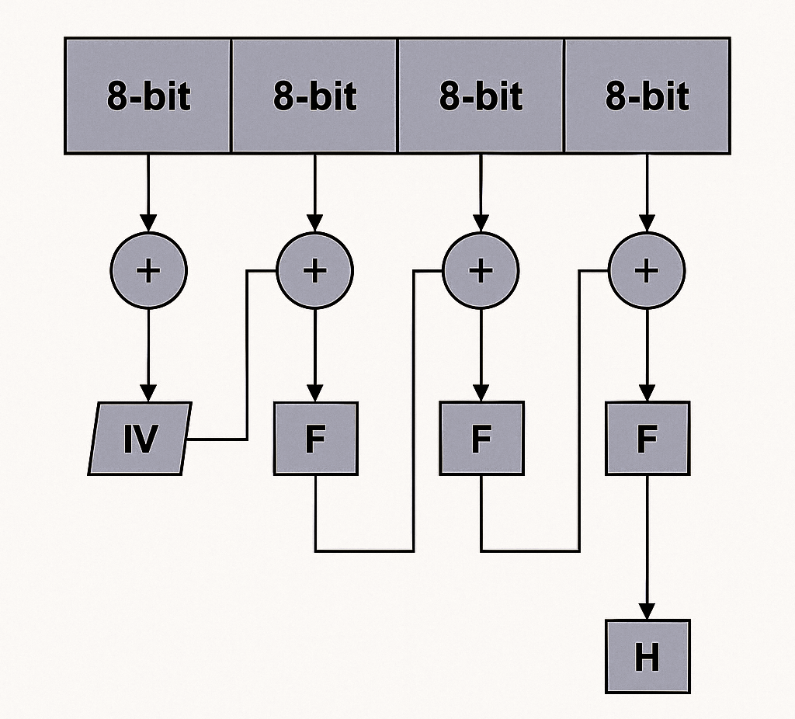

# 🔐 MIPS-8Hash: Custom 8-bit Hash Function via Polynomial Substitution

## 📘 Overview

This project implements a unique 8-bit hashing algorithm in **MIPS assembly language**, created as part of the **CSE 212s – Computer Organization** course at **Ain Shams University** (Fall 2024). The hashing process is based on XOR operations and polynomial substitution, using a 32-bit input word split into 4 bytes.

The code is written for and tested using the **MARS MIPS Simulator**, ensuring compatibility and correct operation without pseudo-instructions.

---

## 🎯 Objective

- Gain hands-on experience with MIPS assembly programming using **MARS IDE**
- Implement a **custom 8-bit hashing algorithm** that uses:
  - XOR chaining
  - Polynomial transformation (substitution)
  - Memory and register-level manipulation

---

## 🧩 Hashing Algorithm

### 🔢 Input:
- A 32-bit word (passed using the `pa` command-line option in MARS)

### 📊 Diagram:

<p align="center">
  
</p>

### 🔄 Steps:

1. Divide the input 32-bit word into four 8-bit chunks.
2. For each byte:
   - **XOR** it with the result of the previous stage.
   - **Substitute** the result using a polynomial function `F` (provided uniquely for each student).
   - For the **first byte**, use the **initial vector (IV)** instead of a previous hash.
     - IV = last two digits of your faculty ID (replace letters with 0 if needed).
3. The result after the last substitution is the **final 8-bit hash**.

### 📤 Output:
- The final 8-bit hash is:
  - Stored at memory address `0x10010000`
  - Saved in registers `$v0` and `$s0`

---

## 🛠️ Implementation Notes

- Use **pure MIPS instructions only** (no pseudo-instructions)
- Implement the hashing logic in a function named:  
  ```asm
  hash_fn:
